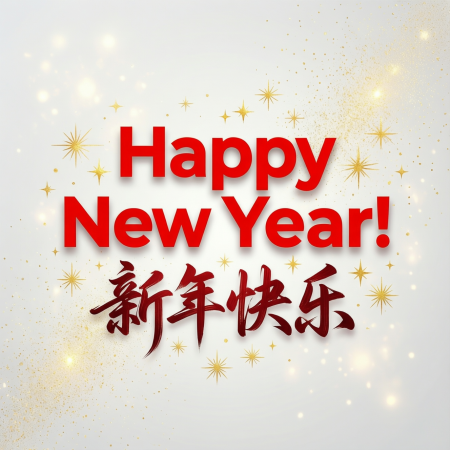
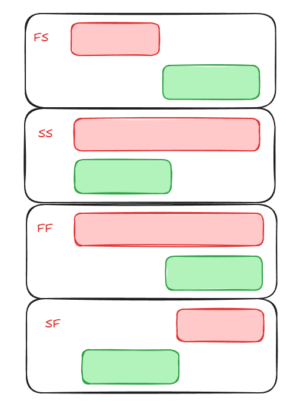

# 2026-1-1-001 Thurdsay

## Diary

今天是2026年的第一天, 也是节假日. 我开车送zz和yt去海宁狗熊冰雪乐园玩. 我自己又开车去海宁图书馆, 继续学习Git & Git Hub.

## to-dos

- [ ] 总结2025
- [ ] 计划2026
  - [ ] 目标
  - [ ] 愿望
  - [ ] 书单
- [ ] 照顾父母/孩子/wife
- [ ] 如何与他人沟通
- [ ] 专业知识 (Maxwell)
- [ ] 拥抱AI

## 自律声明

- [ ] 每月至精度一本书
- [ ] 每周写至少一篇blog
- [ ] 每天刮胡子再出门
- [ ] 工作日不穿休闲服
- [ ] 管理体味
- [ ] 管理外在形象
- [ ] 管理桌面
- [ ] 不要怕被人讨厌
- [ ] xxx

## 新闻

- Manus被Mate收购, 新的造富神话.
- Nvidia的首席科学家是华人

## 本周格言

- 

## 本周学习

- [ ] [how to use Microsoft project](https://www.bilibili.com/video/BV1BeByBHE2U?spm_id_from=333.788.player.switch&vd_source=b24ecf2642ccc76f5b20d4c89278a8d4&p=20)

- input 5d set the duration (cover weekend)
- input 0d set the milestone
- always set milestone 0d

**Predecessors**

- `FS` -Finish to Start.
- `SS` -Start to Start.
- `FF` -Finish to Finish
- `SF` -Start to Finish

- *slack time*
- *Float time*
- *Critical path*
